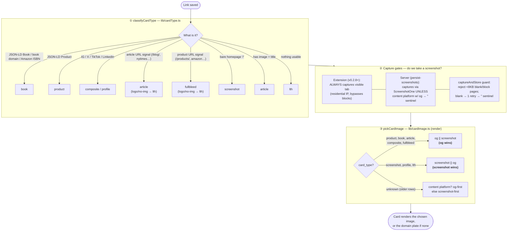

# How a card decides its image

Every bullet renders as a card with one thumbnail. That thumbnail is either the
site's **og:image** (the picture the publisher put in its meta tags) or a
**screenshot** (a captured picture of the page itself). This doc is the map of
how that choice gets made — it's spread across four files and three distinct
decision points, so here's the whole thing in one place.

The three questions, in order:

1. **What kind of thing is this link?** → `classifyCardType` sets a `card_type`.
2. **Do we even capture a screenshot?** → capture gates in the extension + server.
3. **Given what we have, which image do we show?** → `pickCardImage` at render.

## ① `classifyCardType` — what kind of thing is this?

[`lib/cardType.ts`](../lib/cardType.ts) — the single source of truth for the
link's type, run at save time. **First match wins**, top to bottom:

| Order | Signal | → `card_type` |
|---|---|---|
| 1 | JSON-LD `Book`, a book domain (`bookshop.org`, `goodreads.com`…), or an Amazon ISBN URL | `book` |
| 2 | JSON-LD `Product` (price optional) | `product` |
| 3 | Social domain (IG, X, TikTok, Threads, Pinterest) — real og | `composite` (else `profile`) |
| 4 | LinkedIn | `composite` if og, else `profile` |
| 5 | Article URL signal (`/blog/`, `/article`, `nytimes.com`…) | `article` — but logo-shaped/missing image → `lth` |
| 6 | Product URL signal (`/products/`, `/shop/`, `amazon.com`…) | `fullbleed` — logo/missing → `lth` |
| 7 | **Bare homepage** (path is `/`) | `screenshot` |
| 8 | Fallback: has a real (non-logo) image + title | `article` |
| 9 | Nothing usable (logo-only or no image) | `lth` |

The type names map to layouts (`product` = product shot + price chip, `book` =
portrait cover, `article` = image-on-top, `lth` = "link-that-hosts" branded
fallback, etc.). The three hardcoded lists (`BOOK_DOMAINS`,
`PRODUCT_URL_SIGNALS`, `ARTICLE_URL_SIGNALS`) are curated — add to them when a
site classifies wrong.

## ② Capture gates — do we even take a screenshot?

A card can only *show* a screenshot if one was captured. Two capture paths:

**Extension** ([`extension/background.js`](../extension/background.js)) — since
**v0.2.8**, always captures the visible tab with `captureVisibleTab`. It runs in
the user's own browser (their session + residential IP), so it bypasses the
datacenter-IP blocks that defeat the server path (paywalls, Cloudflare/Shopify
bot walls). It sends **both** the client screenshot and the og image; the server
stores the screenshot and lets ③ choose.

**Server** ([`app/api/persist-screenshots`](../app/api/persist-screenshots/route.ts))
— captures via ScreenshotOne for any row that still needs one, **except**
content platforms that already have an og image (YouTube, Spotify, etc. — the og
*is* the content), which get the `''` sentinel and skip capture.

**The blank-capture guard** ([`lib/screenshot.ts`](../lib/screenshot.ts)) — some
sites return HTTP 429/403 to ScreenshotOne's datacenter IP; because we pass
`ignore_host_errors`, we'd otherwise capture the site's *own* blank block page (a
valid ~3–5KB image). `captureAndStore` rejects anything under **8KB** (a real
1280×900 webp is 11KB+ even for near-empty pages). A blank gets one retry, then
the row is sentinel'd with `''` so it stops retrying and renders the domain plate.

## ③ `pickCardImage` — which image wins?

[`lib/cardImage.ts`](../lib/cardImage.ts) — the render-time chooser. `card_type`
decides the preference; the other source is the fallback:

| `card_type` | Preference |
|---|---|
| `product`, `book`, `article`, `composite`, `fullbleed` | **og** image (falls back to screenshot) |
| `screenshot`, `profile`, `lth` | **screenshot** (falls back to og) |
| *(unknown — older unclassified rows)* | content platform → og-first; else screenshot-first |

Rationale: for content-type cards the og *is* the designed image (product shot,
article hero, tweet media) so it wins; for landing/profile pages the og is
usually a bare logo, so the screenshot ("a window onto the site") wins.

If neither source resolves, [`BookmarkCard`](../components/BookmarkCard.tsx)
renders a centered **domain plate** (e.g. `heat.io`) — never a broken/blank box.

## The one seam to know about

②'s capture gates and ③'s pick rule are computed independently, so they can
disagree. A `screenshot`-type page (③ wants the *screenshot*) that also has an og
image used to hit the old extension gate ("skip the screenshot, we have an og"),
so no screenshot was ever captured and it fell back to the og. That's why the
Primal Pastures homepage showed its steak og instead of the full-page shot mymind
gets. **v0.2.8 closed this** by always client-capturing — now ② always supplies
what ③ prefers. Keep this in mind if you touch either layer: capture-time should
serve what render-time prefers, not second-guess it.

---
*Maintained alongside the code. If you change `classifyCardType`, the capture
gates, or `pickCardImage`, update the matching section here.*
